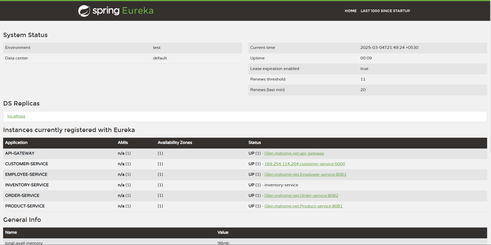

# Supermarket Microservices Architecture

This repository contains a distributed Supermarket application built using a microservices architecture. The system includes several microservices that handle different functionalities, such as employee management, customer management, product management, order processing, inventory management, and service routing via an API Gateway.

**The following services are included:**

* Eureka Server (Spring Boot) - Service registry and discovery.

* Employee Service (Spring Boot) - Manages employee-related data.

* Customer Service (Python) - Handles customer-related data.

* Product Service (Spring Boot) - Manages product-related data.

* Order Service (Spring Boot) - Manages order-related operations.

* Inventory Service (Node.js/Express) - Manages inventory and stock levels.

* API Gateway (Spring Boot) - Centralized access point for all services.

## Project Overview

The Supermarket Microservices project consists of multiple independent microservices communicating with each other. These services are registered and discovered using Eureka Server. The API Gateway acts as a reverse proxy to route client requests to the appropriate microservice.

### Services:

1. Eureka Server: Acts as a service registry for all microservices.

3. Employee Service: Manages employee data (e.g., names, roles).
5. Customer Service: Manages customer data (e.g., customer registration, profile).
7. Product Service: Manages products in the supermarket (e.g., names, prices, availability).
9. Order Service: Handles order creation, tracking, and management.
11. Inventory Service: Manages stock levels and inventory updates.
13. API Gateway: A single entry point to interact with all services.

### Prerequisites

1. JDK 8+ (for Spring Boot services)
3. Python 3.x (for Customer Service)
5. Node.js and npm (for Inventory Service)
7. Maven (for building Spring Boot applications)
9. Docker (for containerization, if desired)
11. PostgreSQL (or another database) for data persistence

## Running the Application

To run the Supermarket Microservices project, follow these steps to start the services.

1. Eureka Server (Spring Boot)

* Navigate to the eureka-server directory.
* Build and run the application:

`mvn clean install`

`mvn spring-boot:run`

2. Employee Service (Spring Boot)

* Navigate to the employee-service directory.
* Build and run the application

`mvn clean install`

`mvn spring-boot:run`

3. Customer Service (Python)

* Navigate to the customer-service directory.
* Install Python dependencies:

`pip install -r requirements.txt`

`python app.py`

4. Product Service (Spring Boot)

* Navigate to the product-service directory.
* Build and run the application

`mvn clean install`

`mvn spring-boot:run`

5. Order Service (Spring Boot)

* Navigate to the order-service directory.
* Build and run the application

`mvn clean install`

`mvn spring-boot:run`

6. Inventory Service (Node.js with Express)

* Navigate to the inventory-service directory.
* Install dependencies

`npm install`

`npm start`

7. API Gateway (Spring Boot)

* Navigate to the api-gateway directory.
* Build and run the application

`mvn clean install`

`mvn spring-boot:run`

## ScreenShot of Eureka Server

